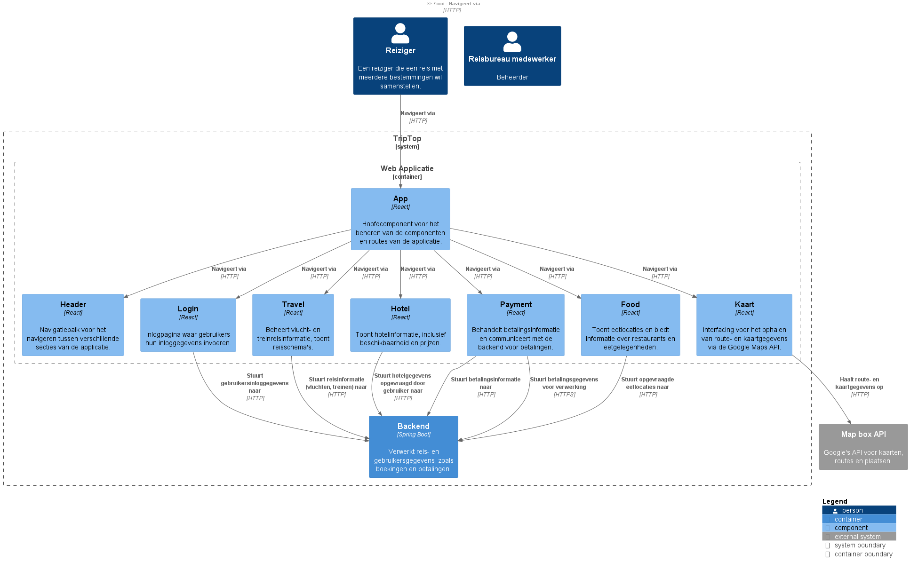
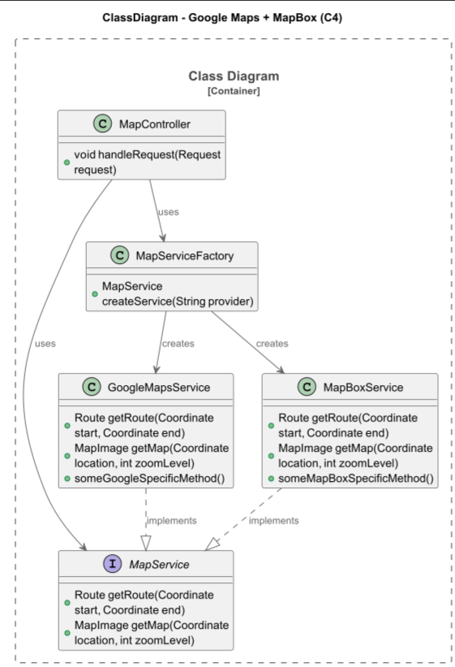

# Software Guidebook Triptop

## 1. Introduction
Dit software guidebook geeft een overzicht van de Triptop-applicatie. Het bevat een samenvatting van het volgende:
1. De vereisten, beperkingen en principes.
1. De software-architectuur, met inbegrip van de technologiekeuzes op hoog niveau en de structuur van de software.
1. De ontwerp- en codebeslissingen die zijn genomen om de software te realiseren.
1. De architectuur van de infrastructuur en hoe de software kan worden geinstalleerd.

## 2. Context

> [!IMPORTANT]
> Werk zelf dit hoofdstuk uit met context diagrammen en een beschrijving van de context van de software.


In de frontend van **Triptop** kunnen reizigers hun vakantie plannen door verschillende reiscomponenten, zoals overnachtingen, vervoer en activiteiten, te combineren. De gebruikersinterface biedt reizigers de mogelijkheid om deze bouwstenen toe te voegen, te beheren en te boeken. Elke component heeft een duidelijke status, zoals "gepland", "betaald", "geregeld" of "uitgevoerd", die wordt weergegeven zodat reizigers altijd weten in welke fase hun reis zich bevindt.

Reizigers kunnen eenvoudig schakelen tussen verschillende externe systemen, zoals boekingsplatforms voor overnachtingen of vervoersdiensten, binnen de applicatie.

Daarnaast maakt Triptop gebruik van een centrale identity provider waarmee reizigers zich kunnen inloggen via accounts zoals Google, Microsoft of Airbnb. Dit elimineert de noodzaak voor het aanmaken van een apart Triptop-account en zorgt voor een gestroomlijnde gebruikerservaring.

De frontend houdt reizigers op de hoogte van de voortgang van hun reis. Dit omvat het tonen van updates over de status van boekingen, betalingen en andere belangrijke reisinformatie. De applicatie biedt ook de mogelijkheid om reisplannen aan te passen, annuleren of betalingen te verrichten, wat essentieel is voor de functionaliteit van het platform. De gebruikersinterface is ontworpen om deze interacties op een duidelijke, gebruiksvriendelijke manier te presenteren, wat bijdraagt aan een optimale ervaring voor de reiziger.


## 3. Functional Overview

Om de belangrijkste features toe te lichten zijn er user stories en twee domain stories gemaakt en een overzicht van het domein in de vorm van een domeinmodel. Op deze plek staat typisch een user story map maar die ontbreekt in dit voorbeeld.

### 3.1 User Stories

#### 3.1.1 User Story 1: Reis plannen

Als gebruiker wil ik een zelfstandig op basis van diverse variabelen (bouwstenen) een reis kunnen plannen op basis van mijn reisvoorkeuren (wel/niet duurzaam reizen, budget/prijsklasse, 's nachts reizen of overdag etc.) zodat ik op vakantie kan gaan zonder dat hiervoor een reisbureau benodigd is.

#### 3.1.2 User Story 2: Reis boeken

Als gebruiker wil ik een geplande reis als geheel of per variabele (bouwsteen) boeken en betalen zodat ik op vakantie kan gaan zonder dat hiervoor een reisbureau benodigd is.

#### 3.1.3 User Story 3: Reis cancelen

Als gebruiker wil ik een geboekte reis, of delen daarvan, kunnen annuleren zodat ik mijn geld terug kan krijgen zonder inmenging van een intermediair zoals een reisbureau.

#### 3.1.4 User Story 4: Reisstatus bewaren

Als gebruiker wil ik mijn reisstatus kunnen bewaren zonder dat ik een extra account hoef aan te maken zodat ik mijn reis kan volgen zonder dat ik daarvoor extra handelingen moet verrichten.

#### 3.1.5 User Story 5: Bouwstenen flexibel uitbreiden

Als gebruiker wil ik de bouwstenen van mijn reis flexibel kunnen uitbreiden met een zelf te managen stap (bijv. met providers die niet standaard worden aangeboden zoals een andere reisorganisatie, hotelketen etc.) zodat ik mijn reis helemaal kan aanpassen aan mijn wensen.

### 3.2 Domain Story Reis Boeken (AS IS)


### 3.3 Domain Story Reis Boeken (TO BE)


### 3.4 Domain Model


## 4. Quality Attributes

Voordat deze casusomschrijving tot stand kwam, heeft de opdrachtgever de volgende ISO 25010 kwaliteitsattributen benoemd als belangrijk:
* Compatibility -> Interoperability (Degree to which a system, product or component can exchange information with other products and mutually use the information that has been exchanged)
* Reliability -> Fault Tolerance (Degree to which a system or component operates as intended despite the presence of hardware or software faults)
* Maintainability -> Modularity (Degree to which a system or computer program is composed of discrete components such that a change to one component has minimal impact on other components)
* Maintainability -> Modifiability (Degree to which a product or system can be effectively and efficiently modified without introducing defects or degrading existing product quality)
* Security -> Integrity (Degree to which a system, product or component ensures that the state of its system and data are protected from unauthorized modification or deletion either by malicious action or computer error)
* Security -> Confidentiality (Degree to which a system, product or component ensures that data are accessible only to those authorized to have access)

## 5. Constraints

> [!IMPORTANT]
> Beschrijf zelf de beperkingen die op voorhand bekend zijn die invloed hebben op keuzes die wel of niet gemaakt kunnen of mogen worden.
## 6. Principles

> [!IMPORTANT]
> Beschrijf zelf de belangrijkste architecturele en design principes die zijn toegepast in de software.

## 6. Principes

### 1. Modulariteit & Scheiding van Verantwoordelijkheden
- **Factory Pattern**: Flexibele keuze tussen kaartdiensten (Google Maps, Mapbox) via `MapServiceFactory`.
- **Interface Segregation**: Kaartservices implementeren gemeenschappelijke interface `MapService` voor scheiding van verantwoordelijkheden.
- **Strategy Pattern**: Keuze van vluchtinformatieprovider (AeroDataBox, FlightRadar24) via strategieën (`IVluchtDataStrategy`).

### 2. Configuratie via Properties
- API-keys en URL's worden opgeslagen in `application.properties` en `.env` voor veiligheid en flexibiliteit.

### 3. RESTful API Design
- Duidelijke en consistente API (`/maps/route`) met HTTP GET requests voor het ophalen van routes.
- RESTful principes worden nageleefd: stateless, query parameters voor dynamische keuze van providers.

### 4. Externe API Integratie
- **Google Maps API** via RapidAPI met authenticatie via headers.
- **Mapbox API** via directe URL-constructie.
- **AeroDataBox** en **FlightRadar24** via RapidAPI met benodigde headers.

### 5. Logging & Debugging
- API-responses worden gelogd voor snelle foutdetectie en debugging, zoals "Invalid API Key" of "NoSegment".

### 6. Design Patterns
- **Factory** en **Strategy Patterns** zorgen voor uitbreidbaarheid en scheiding van verantwoordelijkheden, wat de onderhoudbaarheid verhoogt.

## 7. Software Architecture

###     7.1. Containers

> [!IMPORTANT]
> Voeg toe: Container Diagram plus een Dynamic Diagram van een aantal scenario's inclusief begeleidende tekst.

#### 7.1.1 Container Diagram


Het Triptop-systeem bestaat uit verschillende componenten die samenwerken om een reisplatform te ondersteunen. De Webapplicatie biedt de interface voor gebruikers, terwijl de Backend de logica en verwerking van reisboekingen afhandelt. De Database slaat belangrijke reis- en gebruikersgegevens op.

Externe systemen zoals de Identity Provider API en betalingssystemen zoals Mollie API zijn geïntegreerd voor gebruikersauthenticatie en betalingsverwerking. Daarnaast wordt er gebruik gemaakt van verschillende externe APIs voor reisopties, vervoersinformatie en eet- en drinkmogelijkheden.

De communicatie tussen de verschillende onderdelen van het systeem zorgt voor een gestroomlijnde ervaring voor de reiziger, waarbij gegevens over reizen en boekingen up-to-date worden gehouden en verwerkt.
#### 7.1.2 Dynamic Diagrams
##### 7.1.2.1 Login


Dit diagram illustreert het proces van inloggen binnen de **Triptop** applicatie. Het beschrijft de interacties tussen de **Web Applicatie**, de **Backend**, en de **Identity Provider API** die de inloggegevens van de gebruiker verifieert. Het proces verloopt in vier stappen:

1. De **reiziger** voert zijn inloggegevens in via de **Web Applicatie**.
2. De **Backend** verwerkt deze inloggegevens en stuurt ze naar de **Identity Provider API** voor verificatie.
3. De **Identity Provider API** bevestigt of wijst de inlogpoging af.
4. De **Backend** stuurt het resultaat van de inlogpoging (succes of mislukking) terug naar de **Web Applicatie**, die het resultaat aan de gebruiker toont.

##### 7.1.2.2 Booking


Dit diagram toont de flow van het boeken van een reis binnen de **Triptop** applicatie. Het proces bestaat uit meerdere interacties tussen de **Web Applicatie**, de **Backend**, de **Database**, en externe systemen zoals de **Demand API** (voor reisopties) en de **Mollie API** (voor betalingen). Het proces verloopt als volgt:

1. De **reiziger** selecteert reisopties via de **Web Applicatie**.
2. De **Backend** haalt beschikbare reisopties op van de **Demand API**.
3. De **Web Applicatie** toont de opgehaalde reisopties aan de **reiziger**.
4. Wanneer de **reiziger** een boeking bevestigt, slaat de **Backend** de boekingsgegevens op in de **Database**.
5. De **Backend** verwerkt de betaling via de **Mollie API**.
6. Ten slotte toont de **Web Applicatie** een bevestiging van de boeking aan de **reiziger**.

###     7.2. Components
> [!IMPORTANT]
> Voeg toe: Component Diagram plus een Dynamic Diagram van een aantal scenario's inclusief begeleidende tekst.

#### 7.2.1 Component Diagram Frontend


De frontend van TripTop is ontworpen om een naadloze en gebruiksvriendelijke ervaring te bieden voor reizigers bij het plannen van hun reizen. De applicatie is opgebouwd met React en bestaat uit verschillende componenten die samenwerken om de gebruiker door de reisplanning te leiden. Belangrijk is de flexibiliteit van de interface, waarbij gebruikers snel kunnen schakelen tussen verschillende secties zoals Hotel, Travel, Kaart en Food zonder verlies van context.

De Header zorgt voor eenvoudige navigatie tussen de verschillende secties, terwijl de Login-component het gebruikers mogelijk maakt zich snel in te loggen via gestandaardiseerde inlogopties. Het systeem is geoptimaliseerd voor het snel ophalen en weergeven van gegevens, zoals route-informatie van de MapBox API, en reisopties van de backend.

De frontend zorgt voor een dynamische interactie met de backend, waarbij gebruikers hun reisgegevens en betalingen kunnen beheren via de Payment en Hotel componenten. De frontend is dus niet alleen een weergave van de data, maar fungeert als een interactief platform waar de gebruiker zijn reis samenstelt, boekt en betaalt met minimale vertraging.

#### 7.2.2 Component Diagram Backend


Het backend van het systeem is opgebouwd met Spring Boot en bestaat uit verschillende componenten die elk een specifieke taak vervullen in de verwerking van reisgerelateerde gegevens. Het beheert niet alleen de interacties met de externe API’s voor hotels, vluchten, treinen, betalingen en eten, maar zorgt ook voor de interne verwerking van gegevens en de opslag in de PostgreSQL database. Belangrijk is dat de backend een gedetailleerde scheiding heeft tussen de controllers, services en providers, waardoor elke functionaliteit modulair en flexibel is. Dit maakt het mogelijk om eenvoudig nieuwe externe systemen te integreren of bestaande services aan te passen zonder de rest van de backend te beïnvloeden.

De backend zorgt voor een betrouwbare afhandeling van loginverzoeken door gebruik te maken van een gestandaardiseerde LoginController en een LoginService, die gebruikersgegevens valideren. Het systeem maakt ook gebruik van abstracties via providers, zoals HotelProvider en PaymentProvider, die de communicatie met externe systemen zoals Mollie API voor betalingen en Grubhub API voor eten afhandelen. Deze abstracties zorgen ervoor dat de backend eenvoudig kan communiceren met externe API's, en het maakt de backend uitbreidbaar voor andere systemen die in de toekomst mogelijk geïntegreerd moeten worden.

#### 7.2.3 Component Diagram


Dit dynamische componentendiagram beschrijft de betalingsverwerking in een webapplicatie voor uitgavenbeheer. De gebruiker initieert een betaling via de WebApp (React), die het verzoek doorstuurt naar de backend (Spring Boot).

De backend bestaat uit drie componenten: BetaalController verwerkt inkomende verzoeken, BetaalService voert de betalingslogica uit, en PaymentProvider handelt de communicatie met externe betalingsdiensten af. De Mollie API wordt hier als externe provider gebruikt.

Door PaymentProvider als tussenlaag te gebruiken, blijft de backend losgekoppeld van een specifieke betalingsaanbieder, waardoor het eenvoudig is om andere providers toe te voegen. De scheiding tussen controller, service en provider maakt de code beter onderhoudbaar en uitbreidbaar.

#### 7.2.4 Mapping van domeinmodel
| Class::Attribuut                                                | Is input voor API+Endpoint                          | Wordt gevuld door API+Endpoint | Wordt geleverd door eindgebruiker | Moet worden opgeslagen in de applicatie |
|-----------------------------------------------------------------|-----------------------------------------------------|--------------------------------|-----------------------------------|-----------------------------------------|
| MapService::getRoute(start, end)                                | Google Maps API /directions, MapBox API /directions | ✅                              | ✅                                 | ❌                                       |
| MapService::getMap(location, zoomLevel)                         | Google Maps API /staticmap, MapBox API /static      | ✅                              | ✅                                 | ❌                                       |
| GoogleMapsService::someGoogleSpecificMethod()                   | Google Maps API specifieke functionaliteit          | ✅                              | ❌                                 | ❌                                       |
| MapBoxService::someMapBoxSpecificMethod()                       | MapBox API specifieke functionaliteit               | ✅                              | ❌                                 | ❌                                       |
| MapController::handleRequest(request)                           | ❌                                                 | ❌                              | ✅                                 | ❌                                       |
| MapServiceFactory::createService(provider)                      | ❌                                                 | ❌                              | ✅                                 | ❌                                       |
| MapboxController::getDirections(origin, waypoints, destination) | GET /directions                                    | ✅                              | ✅                                 | ❌                                       |
| MapboxController::getRouting()                                  | GET /routing                                       | ✅                              | ❌                                 | ❌                                       |
| MapboxController::nextRouting()                                 | POST /routing                                      | ✅                              | ❌                                 | ❌                                       |
| WebApp::searchFlights(flightQuery)                              | AeroDataBox API /flights/search, FR24 API /flights | ✅                              | ✅                                 | ❌                                       |
| WebApp::getFlightStatus(flightDetails)                          | AeroDataBox API /flights/status, FR24 API /status  | ✅                              | ✅                                 | ❌                                       |
| FlightController::fetchFlightData(flightQuery)                  | AeroDataBox API /flights/search, FR24 API /flights | ✅                              | ✅                                 | ❌                                       |
| FlightService::fetchFlightData(flightQuery)                     | AeroDataBox API /flights/search, FR24 API /flights | ✅                              | ✅                                 | ❌                                       |
| FlightService::setFlightDataStrategy(strategy)                  | ❌                                                 | ❌                              | ✅                                 | ✅                                       |
| StrategyService::setCurrentStrategy(strategy)                   | ❌                                                 | ❌                              | ✅                                 | ✅                                       |
| StrategyService::getCurrentStrategy()                           | ❌                                                 | ✅                              | ❌                                 | ✅                                       |
| AeroDataBoxProvider::fetchFlightData(flightQuery)               | AeroDataBox API /flights/search                    | ✅                              | ✅                                 | ❌                                       |
| AeroDataBoxProvider::fetchNearbyAirports(airport)               | AeroDataBox API /airports/nearby                   | ✅                              | ✅                                 | ❌                                       |
| FlightRadar24Provider::fetchFlightData(flightQuery)             | FlightRadar24 API /flights/search                  | ✅                              | ✅                                 | ❌                                       |
| FlightRadar24Provider::fetchNearbyAirports(airport)             | FlightRadar24 API /airports/nearby                 | ✅                              | ✅                                 | ❌                                       |
| LoginService::authenticateUser(credentials)                    | Identity Provider API (Google, Apple, Microsoft)   | ✅                              | ✅                                 | ✅                                       |
| HotelController::fetchHotelData(hotelQuery)                     | Booking API /hotels/search                         | ✅                              | ✅                                 | ❌                                       |
| HotelService::fetchHotelData(hotelQuery)                        | Booking API /hotels/search                         | ✅                              | ✅                                 | ❌                                       |
| HotelProvider::fetchHotelData(hotelQuery)                       | Booking API /hotels/search                         | ✅                              | ✅                                 | ❌                                       |
| PaymentController::processPayment(paymentDetails)               | Mollie API /payments                               | ✅                              | ✅                                 | ❌                                       |
| PaymentService::processPayment(paymentDetails)                  | Mollie API /payments                               | ✅                              | ✅                                 | ❌                                       |
| PaymentProvider::processPayment(paymentDetails)                 | Mollie API /payments                               | ✅                              | ✅                                 | ❌                                       |
| TrainController::fetchTrainData(trainQuery)                     | All Aboard API /trains/search                      | ✅                              | ✅                                 | ❌                                       |
| TrainService::fetchTrainData(trainQuery)                        | All Aboard API /trains/search                      | ✅                              | ✅                                 | ❌                                       |
| TrainProvider::fetchTrainData(trainQuery)                       | All Aboard API /trains/search                      | ✅                              | ✅                                 | ❌                                       |
| FoodController::fetchFoodData(location)                         | Grubhub API /restaurants/search                    | ✅                              | ✅                                 | ❌                                       |
| FoodService::fetchFoodData(location)                            | Grubhub API /restaurants/search                    | ✅                              | ✅                                 | ❌                                       |
| FoodProvider::fetchFoodData(location)                           | Grubhub API /restaurants/search                    | ✅                              | ✅                                 | ❌                                       |


###     7.3. Design & Code

> [!IMPORTANT]
> Voeg toe: Per ontwerpvraag een Class Diagram plus een Sequence Diagram van een aantal scenario's inclusief begeleidende tekst.

#### 7.3.1
Hoe kunnen we verschillende externe vervoersservices (zoals Google Maps of een veerdienst API) integreren zonder afhankelijk te worden van hun specifieke implementaties?



Dit C4-klasse diagram toont de architectuur van een kaartsysteem dat zowel Google Maps als MapBox ondersteunt. De kern wordt gevormd door de interface MapService, die methoden biedt voor het ophalen van routes en kaartafbeeldingen. GoogleMapsService en MapBoxService implementeren deze interface en voegen hun eigen specifieke functionaliteiten toe.

MapController handelt verzoeken af en maakt gebruik van MapService en MapServiceFactory, die op basis van een providernaam de juiste kaartservice aanmaakt. Coordinate slaat locaties op met breedte- en lengtegraad, Route bevat een lijst van coördinaten die een route vormen, en MapImage houdt kaartafbeeldingen bij als byte-array.

Route, Coordinate en MapImage staan los van de kaartservices (daarom heb ik ze niet in het plaatje gedaan), omdat ze generieke datamodellen vertegenwoordigen die onafhankelijk zijn van een specifieke provider. Dit zorgt ervoor dat de structuur van routes, coördinaten en afbeeldingen uniform blijft, ongeacht of ze afkomstig zijn van Google Maps of MapBox. Hierdoor wordt de koppeling tussen de services en de data geminimaliseerd, wat het systeem flexibeler en beter uitbreidbaar maakt.

#### 7.3.2


In bovenstaand diagram is de architectuur, bijbehorend bij de vraag **"Hoe zorg je voor een zo kort mogelijke reisroute waarbij gebruik gemaakt wordt van alle bouwstenen? Hoe zorg je ervoor dat de reisroute makkelijk aangepast kan worden als reisafstand geen issue is?"**, te zien. Hiervoor hebben we het State Pattern gebruikt, aangezien deze gekozen was als gevolg van een voorgaande opdracht van school (zie [deze ADR](../ADRs/0006-State-pattern.md) voor meer informatie). In `MapboxRoutingManager` is een klein deel weggelaten. Dit deel is verantwoordelijk voor het opstellen van de URL, die gestuurd wordt naar de Mapbox API. `MapboxController#getDirections` heeft de `@GetMapping("/directions")`-annotation erboven staan. Ook zijn alle parameters hiervan annotated met `@RequestParam`, waarbij de `waypoints`'s `@RequestParam` de field `required` op `false` heeft staan. `MapboxController#getRouting` en `MapboxController#nextRouting` hebben de `@GetMapping("/routing")` en `@PostMapping("/routing)"`-annotation erboven staan, respectievelijk.


#### 7.3.3


De frontend van de webapplicatie biedt een intuïtieve gebruikersinterface die gebruikers in staat stelt om eenvoudig naar vluchtinformatie te zoeken en vluchtstatussen te bekijken. De gebruikers kunnen vluchtnummers invoeren in zoekvelden en de resultaten worden direct getoond, zoals de huidige vluchtstatus of vertragingen. Bovendien biedt de frontend de mogelijkheid om een specifieke zoekstrategie te kiezen, zoals het ophalen van gegevens van AeroDataBox of FlightRadar24. Deze keuze wordt doorgestuurd naar de backend via de StrategyController, die ervoor zorgt dat de juiste strategie wordt toegepast voor het ophalen van de gewenste gegevens.

De communicatie tussen de frontend en de backend gebeurt asynchroon, wat betekent dat de pagina niet opnieuw hoeft te laden bij het ophalen van nieuwe informatie, wat de gebruikerservaring versnelt en de applicatie naadloos maakt. Als er fouten optreden, bijvoorbeeld bij het invoeren van een ongeldig vluchtnummer of locatie, toont de frontend duidelijke foutmeldingen om de gebruiker hierover te informeren. Dit zorgt ervoor dat de applicatie zowel snel als gebruiksvriendelijk is, met een efficiënte en duidelijke interactie tussen de frontend en de backend.

#### 7.3.3.1 Ophalen van vluchten


#### 7.3.3.2 Zoeken van luchthavens


#### 7.3.3.3 Wisselen van API


De bovenstaande sequence diagrammen illustreren de interacties tussen verschillende componenten binnen de applicatie. Het eerste diagram toont het proces van het ophalen van vluchtinformatie, waarbij de gebruiker een zoekopdracht indient via de WebApp. De backend verwerkt deze aanvraag en roept de juiste API aan om vluchtgegevens op te halen.
Het tweede diagram laat zien hoe de applicatie de dichtstbijzijnde luchthavens kan vinden. De gebruiker voert een zoekopdracht in, en de backend roept de API aan om relevante luchthavens te vinden.
Het derde diagram illustreert het wisselen van API's. De gebruiker kan een andere API kiezen, en de backend past de configuratie aan om de nieuwe API te gebruiken. Dit toont de flexibiliteit van het systeem in het omgaan met verschillende externe diensten.


#### 7.3.4

Het diagram toont de architectuur en de interacties tussen verschillende klassen binnen het systeem. De structuur is onderverdeeld in meerdere componenten, elk verantwoordelijk voor specifieke functionaliteiten.

## 8. Architectural Decision Records

### 8.1. ADR-0001-Payment Options

# Payment Options
**Datum**: 2025-03-21

## Status
**Accepted**

## Context
We maken een reismanager-app en hiervoor hebben we een Payment API nodig die betalingen afhandelt. Welke API het meest geschikt is, willen we graag weten.

## Considered Options

| Forces                         | Mollie | Knit Pay Pro  | PayPal |
|---------------------------------|--------|---------------|--------|
| Standaard API's beschikbaar     | --     | ?             | ++     |
| Eenvoudig te gebruiken in Java  | 0      | -             | 0      |
|Documentatie                     | -      | --            | ++     |
|Beveliging                       | +      | 0             | +      |

## Decision
Uiteindelijk is de keuze gemaakt om PayPal te gebruiken in plaats van Mollie, omdat we er later achterkwamen dat Mollie een business account nodig heeft om een API-key te verkrijgen. Helaas was Mollie hierdoor niet bruikbaar, hoewel het een goede optie had kunnen zijn. PayPal is veel kennis over te vinden omdat het bekend is.

## Consequences
PayPal is een bekend en betrouwbaar API met goed gedocumenteerde bronnen. Het is volgens bronnen makkelijk te integreren, maar het kan mogelijk problemen opleveren met beveiliging en netwerkverbindingen.

### 8.2. ADR-0002-Flights-Options

# Flights Options

**Datum:** 2025-03-21

## Status
**Accepted**

## Context
Voor onze reismanager-app hebben we een Flights API nodig die vluchten kan opzoeken. We willen bepalen welke API hiervoor het meest geschikt is.

## Considered Options

| Factoren                     | AeroDataBox | FlightsAPI | AmadeusAPI |
|------------------------------|------------|-----------|------------|
| Informatie beschikbaar       | +          | 0         | 0          |
| Eenvoudig te gebruiken       | ++         | --        | +          |
| Real-time vluchtinformatie   | ++         | -         | 0          |
| Documentatie                 | +          | -         | ++         |

## Decision
Uiteindelijk hebben we gekozen voor **AeroDataBox**. De belangrijkste redenen hiervoor zijn:
- **Kosten:** FlightsAPI vereist een maandelijkse betaling, terwijl AeroDataBox gratis of goedkoper is.
- **Focus op vluchten:** AeroDataBox biedt uitgebreide informatie over vluchten, waaronder vluchttracking, vluchtstatus en luchthaveninformatie.
- **Gebruiksvriendelijkheid:** Vergeleken met AmadeusAPI is AeroDataBox veel eenvoudiger te gebruiken, omdat AmadeusAPI een complexere implementatie vereist.

## Consequences
AeroDataBox is ideaal voor real-time tracking en vluchtinformatie. Echter, het biedt geen ondersteuning voor hotels en boekingsservices. Voor deze functionaliteiten zullen we een aanvullende API moeten zoeken.

### 8.3. ADR-0003-Mapbox

# Mapbox

**Datum:** 21/03/2025

## Status
Accepted

## Context
We hebben een API nodig die routes naar bestemmingen kan berekenen en hierbij richtingen kan aangeven. De API moet eenvoudig te integreren zijn binnen ons bestaande systeem, voldoende documentatie bieden en indien nodig aanpasbaar zijn. Daarnaast is prijs een belangrijke factor, evenals gebruiksvriendelijkheid voor zowel ontwikkelaars als eindgebruikers.

## Considered Options
| Forces | Google Maps | Apple Maps | OpenStreetMap (OSM) | Mapbox |
|---|---|---|---|---|
| Prijs | 0 | ++ | ++ | + |
| Aanpasbaarheid | 0 | - | ++ | ++ |
| Integreerbaarheid | + | - | 0 | ++ |
| Gebruiksvriendelijkheid | ++ | ++ | 0 | ++ |
| Beschikbare documentatie | ++ | - | + | ++ |

### Criteria
- **Prijs**: Google Maps heeft een gratis laag, maar kosten kunnen snel oplopen. Apple Maps is gratis, maar beperkt in gebruik buiten het Apple-ecosysteem. OSM en Mapbox zijn goedkoper en bieden flexibele prijsmodellen.
- **Aanpasbaarheid**: Google Maps biedt beperkte aanpassingsmogelijkheden. Apple Maps is gesloten en moeilijk aanpasbaar. OSM en Mapbox bieden uitgebreide mogelijkheden voor maatwerk.
- **Integreerbaarheid**: Google Maps en Mapbox bieden eenvoudige SDK’s en API’s. Apple Maps heeft beperkte ondersteuning buiten iOS/macOS. OSM vereist meer inspanning voor integratie.
- **Gebruiksvriendelijkheid**: Google Maps en Apple Maps bieden intuïtieve en gebruiksvriendelijke interfaces. OSM vereist meer technische kennis. Mapbox biedt een goede balans tussen flexibiliteit en gebruiksgemak.
- **Documentatie**: Google Maps en Mapbox bieden uitgebreide documentatie. Apple Maps heeft minder documentatie beschikbaar. OSM heeft documentatie, maar deze is soms gefragmenteerd.

## Decision

Na evaluatie van de verschillende opties hebben we besloten om voor **Mapbox** te kiezen. Mapbox scoort hoog op vrijwel alle relevante criteria en biedt een goede balans tussen kosten, flexibiliteit en gebruiksvriendelijkheid. De belangrijkste redenen voor deze keuze zijn de aanpasbaarheid van Mapbox, die uitgebreide mogelijkheden biedt voor het aanpassen van kaarten, routes en styling. Daarnaast zijn de integratie-opties goed, aangezien de SDK’s en API’s goed gedocumenteerd zijn en eenvoudig in bestaande systemen te integreren. Wat betreft betaalbaarheid is Mapbox een kosteneffectief alternatief voor Google Maps, met flexibele prijsmodellen, hoewel het niet gratis is. Bovendien biedt de uitstekende documentatie van Mapbox een belangrijke meerwaarde, aangezien deze uitgebreid en goed gestructureerd is, wat de integratie en het onderhoud vergemakkelijkt.

## Consequences

De keuze voor Mapbox heeft enkele gevolgen die moeten worden meegenomen in de implementatie. De kostenstructuur is een belangrijk punt, aangezien, hoewel Mapbox goedkoper is dan Google Maps, er toch een budget gereserveerd moet worden voor gebruikskosten, vooral bij opschaling. De ondersteuning en community van Mapbox zijn goed, maar deze zijn minder breed dan die van Google Maps. Daarnaast maakt Mapbox deels gebruik van OSM-gegevens, wat invloed kan hebben op de nauwkeurigheid en updates van de kaarten. Ten slotte kunnen mogelijke toekomstige veranderingen in de licentie- en prijsstructuur van Mapbox invloed hebben op de langetermijnstrategie.

Door deze aspecten in acht te nemen, kunnen we een robuuste en schaalbare implementatie realiseren. Mapbox biedt een krachtige oplossing die goed aansluit bij onze behoeften, met minimale nadelen.


### 8.4. ADR-0004-Gebruik-van-interface-gebaseerde-afhankelijkheden
# Gebruik van interface-gebaseerde afhankelijkheden

Date: 26-3-2025

## Status
Accepted

## Context
Het systeem moet flexibel blijven als het gaat om externe services. We willen vermijden dat business logic direct afhankelijk is van specifieke API’s zoals Mollie of AeroDataBox.

## Considered Options

| Forces                                  | Strategy Pattern | Adapter Pattern | Facade Pattern | Factory Method Pattern | State Pattern |
|-----------------------------------------|------------------|-----------------|----------------|------------------------|---------------|
| Losse koppeling                         | ++               | ++              | +              | +                      | ++            |
| Onderhoudbaarheid                       | ++               | +               | ++             | -                      | ++            |
| Complexiteit                            | +                | 0               | -              | ++                     | -             |
| Gemak van wisselen van externe services | ++               | +               | 0              | -                      | +             |
| Testbaarheid                            | ++               | +               | -              | 0                      | ++            |
| Geschiktheid voor variërende services   | ++               | 0               | +              | +                      | ++            |

## Decision
We kiezen voor het **Strategy Pattern**, omdat dit de meest flexibele en modulaire oplossing biedt. Elke externe service wordt geïnjecteerd als een implementatie van een generieke interface, waardoor we eenvoudig kunnen wisselen tussen providers zonder de kernlogica te wijzigen.

## Consequences
**Voordelen:**
- Externe services zijn eenvoudig verwisselbaar.
- Business logic blijft gescheiden van de specifieke service-implementatie.
- Ondersteunt uitbreiding met nieuwe services zonder impact op bestaande code.
- Maakt unit testing eenvoudiger door dependency injection.

**Nadelen:**
- Meer complexiteit dan een hardcoded implementatie.
- Vereist duidelijke interfaces en dependency injection.


### 8.5. ADR-0005-Dynamische-Kaartservices-met-de-FactoryMethod
# Navigating the Right Path: Dynamische Kaartservices met de Factory Method

**Date:** 28-3-2025

## Status
**Accepted**

## Context

In de ontwikkeling van dynamische kaartservices is het belangrijk om externe kaartleveranciers zoals Google Maps en MapBox flexibel te integreren.
Het doel is om de kaartprovider te kunnen wisselen zonder het systeem te herontwerpen.
De Factory Method Pattern wordt gekozen om deze flexibiliteit te bieden, waarbij het systeem dynamisch een kaartprovider selecteert en aanmaakt,
zonder de koppeling tussen componenten te verhogen.
## Considered Options

| Forces                                      | Adapter Pattern | Facade Pattern | Factory Method Pattern | State Pattern | Strategy Pattern |
|---------------------------------------------|-----------------|----------------|------------------------|---------------|------------------|
| **Complexiteit**                            | --              | 0              | +                      | +             | 0                |
| **Losse koppeling**                         | +               | ++             | ++                     | 0             | +                |
| **Gemak van wisselen van externe services** | ++              | +              | +                      | -             | +                |
| **Onderhoudbaarheid**                       | 0               | -              | ++                     | -             | +                |
| **Testbaarheid**                            | -               | --             | +                      | 0             | +                |

## Decision

Na het evalueren van de verschillende ontwerppatronen is besloten om de **Factory Method Pattern** te implementeren voor het dynamisch creëren van kaartservice-objecten. Dit patroon biedt de juiste balans tussen complexiteit,
onderhoudbaarheid en losse koppeling. De keuze is gemaakt om de flexibiliteit te behouden bij het toevoegen van nieuwe kaartservices zonder grote wijzigingen aan de bestaande codebasis. De methoden getRoute en getMap worden gedefinieerd in een abstracte MapService klasse, en de concrete implementaties voor Google Maps en MapBox worden dynamisch gecreëerd door de MapServiceFactory.
Factory methode is de beste keuze ondanks dit waren state en strategy ook opties maar deze waren gekozen door mijn groep en daarom geen optie.
## Consequences

**Voordelen:**
- **Flexibiliteit**: Het systeem kan eenvoudig worden aangepast om nieuwe kaartproviders toe te voegen door alleen de MapServiceFactory aan te passen. Er zijn geen grote wijzigingen nodig in de rest van het systeem.
- **Losse koppeling**: De Factory Method zorgt ervoor dat de MapController geen kennis heeft van de specifieke kaartservice (Google Maps of MapBox), wat zorgt voor een losser gekoppeld ontwerp.
- **Onderhoudbaarheid**: Het systeem is makkelijker te onderhouden omdat de kaartservices geïsoleerd zijn van andere delen van de applicatie. Het toevoegen van nieuwe functionaliteit aan een specifieke provider heeft geen invloed op de rest van de applicatie.

**Nadelen:**
- **Minder dynamische flexibiliteit**: Het systeem is niet zo dynamisch in het wisselen van kaartproviders tijdens runtime. Dit kan een beperking zijn als er behoefte is om op de achtergrond snel van provider te wisselen zonder herstart.
- **Testbaarheid**: Het testen van verschillende kaartservices kan moeilijker zijn zonder een goed mock-systeem voor de Factory Method. Het is minder flexibel dan bij bijvoorbeeld de Facade Pattern, waar mock-services gemakkelijker kunnen worden ingevoegd.

### 8.6. ADR-0006-State-pattern

# Kortste Reisroute en Flexibiliteit

**Datum:** 31/03/2025

## Status
Accepted

## Context
Bij het plannen van een reisroute moet rekening worden gehouden met twee belangrijke factoren: de route moet zo kort mogelijk zijn en alle bouwstenen omvatten en de route moet eenvoudig aanpasbaar zijn wanneer de reisafstand geen beperkende factor is.

## Considered Options
| Forces | Adapter | State | Factory | Strategy | Facade |
|---|---|---|---|---|---|
| Makkelijk uitbreidbaar | + | ++ | + | ++ | 0 |
| Weinig boilerplate | 0 | -- | - | + | ++ |
| Vermindert coupling | + | ++ | 0 | + | - |
| Ondersteunt dynamische aanpassingen | ++ | 0 | + | ++ | - |
| Houdt overzichtelijke structuur | 0 | -- | - | + | ++ |

## Decision
Wegens schoolredenen kunnen de Factory en Strategy Pattern niet meer gekozen worden. Verder zijn de Adapter en Facade Pattern geen goede oplossingen voor dit probleem. Hierom kiezen wij voor het implementeren van de State Pattern, ondanks dat dit niet de beste oplossing is.

## Consequences
Het gevolg van het niet meer mogen gebruiken van de Strategy Pattern is dat de implementatie minder overzichtelijk is en dat er meer boilerplate geschreven moet worden.

## 9. Deployment, Operation and Support

### Stappen voor Deployment
Om de Triptop-applicatie te installeren en uit te voeren, volg je de volgende stappen:

#### 1. **Voorbereiding van de omgeving**
- Zorg ervoor dat **Java 17** en **Spring Boot** zijn geïnstalleerd.
- Installeer een geschikte IDE zoals **IntelliJ IDEA** of **Eclipse**.

#### 2. **Code verkrijgen**
- Clone de repository vanuit GitHub:
- Navigeer naar de backend-map:

#### 3. **Configuratie instellen**
- Voeg een `application.properties` bestand toe met API-sleutels:
  ```properties
  google.maps.api.url=https://google-map-places-new-v2.p.rapidapi.com
  google.maps.api.key=JOUW_RAPIDAPI_KEY

  mapbox.api.url=https://api.mapbox.com/directions/v5/mapbox/driving
  mapbox.api.key=JOUW_MAPBOX_API_KEY
  ```
- Voeg ook een `.env` bestand toe met API-sleutels:
```
  RAPIDAPI_KEY=JOUW_RAPIDAPI_KEY
  RAPIDAPI_HOST=aerodatabox.p.rapidapi.com
  FlightScraper_Host=sky-scanner3.p.rapidapi.com
  AirScraper_Host=sky-scrapper.p.rapidapi.com
```

#### 4. **Start de applicatie**
- Gebruik Maven om de applicatie te starten of start het via the IDE:
  ```sh
  mvn spring-boot:run
  ```

#### 5. **Test de API**
- Gebruik **Postman** of **Insomnia** om de API-endpoints te testen.
- Een voorbeeldverzoek voor het ophalen van informatie via Mapbox:
  ```http
  GET http://localhost:8080/maps/route?provider=mapbox&startLat=52.3676&startLng=4.9041&endLat=51.5074&endLng=-0.1278
  ```
### Onderhoud en Support
- **Logging**: Fouten en waarschuwingen worden gelogd via SLF4J/Logback.
- **Monitoring**: Toekomstige integratie met een monitoring-tool zoals Prometheus/Grafana.
- **Bugfixing**: Issues worden bijgehouden in GitHub Issues en opgelost via pull requests.
